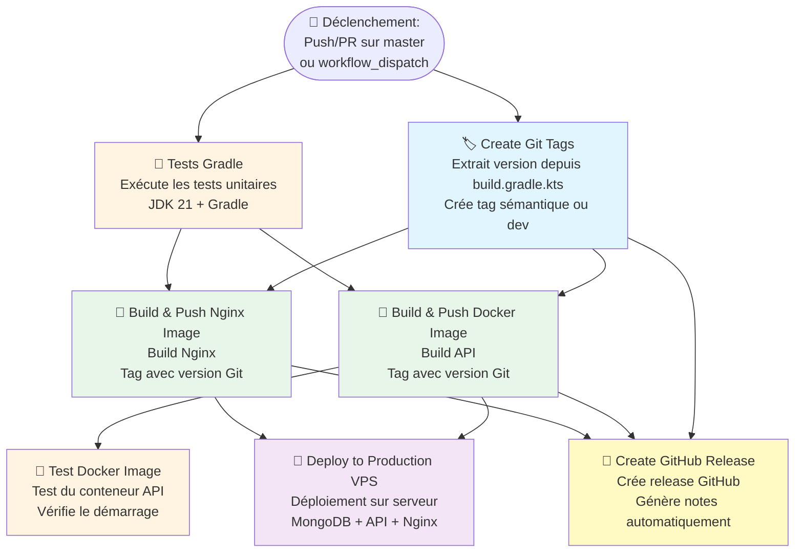

# 🐳 Schéma du Workflow CI/CD - Blogpress Backend API

## 📊 Diagramme des Jobs et Dépendances



## 📋 Description Détaillée des Jobs

### 1. 🏷️ **Create Git Tags** (`tags`)
- **Déclenchement** : Tous les événements
- **Dépendances** : Aucune
- **Actions** :
  - Extrait la version depuis `build.gradle.kts`
  - Analyse les changements (feat, fix, etc.)
  - Crée un tag sémantique (`v1.0.0`) ou de développement (`dev-abc1234-timestamp`)
  - Push le tag vers GitHub
- **Outputs** : `version`, `tag_created`, `tag_name`, `tag_type`, `is_release`, `semantic_version`

### 2. 🧪 **Tests Gradle** (`test`)
- **Déclenchement** : Tous les événements
- **Dépendances** : Aucune
- **Actions** :
  - Setup JDK 21
  - Cache Gradle
  - Exécute `./gradlew clean test`

### 3. 🔨 **Build & Push Docker Image** (`build`)
- **Déclenchement** : Tous les événements
- **Dépendances** : `tags`, `test`
- **Actions** :
  - Login DockerHub
  - Extract metadata (utilise les tags Git)
  - Build l'image API (`azerty78/blogpress-api`)
  - Push vers DockerHub (si pas PR)

### 4. 🔨 **Build & Push Nginx Image** (`build-nginx`)
- **Déclenchement** : Tous les événements
- **Dépendances** : `tags`, `test`
- **Actions** :
  - Test syntaxe Nginx
  - Extract metadata (utilise les tags Git)
  - Build l'image Nginx (`azerty78/blogpress-nginx`)
  - Push vers DockerHub (si pas PR)

### 5. 🧪 **Test Docker Image** (`test-image`)
- **Déclenchement** : Uniquement sur push (pas sur PR)
- **Dépendances** : `build`
- **Actions** :
  - Pull l'image buildée
  - Démarre le conteneur
  - Vérifie le health check

### 6. 🚀 **Deploy to Production VPS** (`deploy`)
- **Déclenchement** : Uniquement sur push vers `master`
- **Dépendances** : `build`, `build-nginx`
- **Actions** :
  - Setup SSH
  - Vérifie/Installe Docker sur le VPS
  - Crée structure de dossiers
  - Copie fichiers de configuration
  - Met à jour fichiers `.env`
  - Login DockerHub sur VPS
  - Déploie MongoDB
  - Déploie API
  - Déploie Nginx
  - Vérifie le déploiement

### 7. 🚀 **Create GitHub Release** (`release`)
- **Déclenchement** : Uniquement sur push vers `master` (si tag créé)
- **Dépendances** : `tags`, `build`, `build-nginx`
- **Actions** :
  - Vérifie que le tag existe
  - Génère les notes de release
  - Crée la release GitHub (prerelease si tag dev)

## 🔄 Flux d'Exécution

### Sur Pull Request :
```
                    ┌─────────────┐
                    │   🚀 Start  │
                    └──────┬──────┘
                           │
            ┌──────────────┴──────────────┐
            │                             │
    ┌───────▼───────┐           ┌────────▼────────┐
    │  🏷️  tags    │           │  🧪  test       │
    └───────┬───────┘           └────────┬────────┘
            │                             │
            │      ┌──────────────────────┘
            │      │
    ┌───────▼───────▼────────┐
    │  🔨  build             │
    └───────┬────────────────┘
            │
    ┌───────▼────────┐
    │  🧪 test-image │
    └────────────────┘

    ┌────────▼────────┐
    │ 🔨 build-nginx  │
    └─────────────────┘
```

### Sur Push vers master :
```
                    ┌─────────────┐
                    │   🚀 Start  │
                    └──────┬──────┘
                           │
            ┌──────────────┴──────────────┐
            │                             │
    ┌───────▼───────┐           ┌────────▼────────┐
    │  🏷️  tags    │           │  🧪  test       │
    └───────┬───────┘           └────────┬────────┘
            │                             │
            │      ┌──────────────────────┘
            │      │
    ┌───────▼───────▼────────┐
    │  🔨  build             │
    └───────┬────────────────┘
            │
    ┌───────▼────────┐
    │  🧪 test-image │
    └────────────────┘

    ┌────────▼────────┐
    │ 🔨 build-nginx  │
    └────────┬────────┘
             │
    ┌────────┴────────┐
    │                 │
    │  ┌──────────────▼──────────────┐
    │  │  🚀  deploy                 │
    │  │  (nécessite build +         │
    │  │   build-nginx)              │
    │  └─────────────────────────────┘
    │
    ┌─▼──────────────────────────────┐
    │  🚀  release                   │
    │  (nécessite tags + build +    │
    │   build-nginx)                │
    └────────────────────────────────┘
```

## 📦 Images Docker Générées

### API (`azerty78/blogpress-api`)
- Tags possibles :
  - `v1.0.0` (si release sémantique)
  - `dev-abc1234-20250101120000` (si tag dev)
  - `master` (si sur branche master)
  - `sha-abc1234` (fallback)
  - `latest` (si sur master)

### Nginx (`azerty78/blogpress-nginx`)
- Mêmes tags que l'API

## 🎯 Conditions de Déclenchement

| Job | Condition |
|-----|-----------|
| `tags` | Toujours |
| `test` | Toujours |
| `build` | Si `tags` et `test` réussis |
| `build-nginx` | Si `tags` et `test` réussis |
| `test-image` | Si `build` réussi ET pas PR |
| `deploy` | Si `build` + `build-nginx` réussis ET push sur master |
| `release` | Si `tags` + `build` + `build-nginx` réussis ET push sur master ET tag créé |

## 🔐 Permissions Requises

- `contents: write` - Pour créer releases et pousser tags
- `packages: write` - Pour pousser images Docker

## 🔑 Secrets GitHub Requis

- `DOCKERHUB_USERNAME`
- `DOCKERHUB_PASSWORD`
- `VPS_HOST`
- `VPS_USERNAME`
- `VPS_PORT` (optionnel)
- `VPS_SSH_KEY`
- `GITHUB_TOKEN` (automatique)
